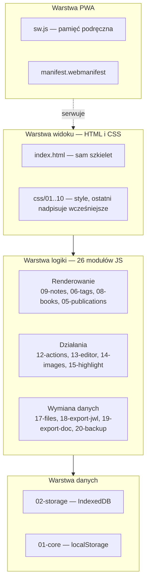

# Architektura

## W jednym zdaniu

JW Study to aplikacja działająca w całości w przeglądarce: brak serwera, brak konta,
brak wysyłania danych. Notatki leżą w pamięci urządzenia, a Service Worker sprawia,
że aplikacja otwiera się także bez internetu.

## Warstwy



**Widok** nie zawiera logiki — `index.html` to szkielet z pustymi kontenerami,
które wypełniają funkcje renderujące.

**Logika** dzieli się na trzy grupy: renderowanie (co widać), działania (co użytkownik
robi z notatką) i wymianę danych ze światem (JW Library, Word, PDF, kopie JSON).

**Dane** mają dwa magazyny o różnym przeznaczeniu: IndexedDB na treść (notatki, etykiety,
sekcje) i localStorage na ustawienia. Rozdział jest celowy — localStorage ma ok. 5 MB
i zapisuje synchronicznie, więc nie nadaje się na treść.

## Zasady, na których stoi kod

**Jeden zakres globalny.** Moduły to zwykłe skrypty ładowane po kolei, bez `import`.
Funkcja z modułu 09 jest widoczna w module 20, bo wszystkie dzielą przestrzeń nazw.
Cena: **kolejność ładowania jest częścią kontraktu** — moduł może w czasie ładowania
używać tylko tego, co zdefiniowano wcześniej. Pilnuje tego analizator kolejności.

**Renderowanie zamiast wiązania danych.** Nie ma reaktywności ani obserwatorów.
Po zmianie danych wołane jest `renderAll()`, a poszczególne funkcje same decydują,
czy jest co odświeżać (porównanie „odcisku" karty, porównanie wynikowego HTML).

**Zapis natychmiastowy.** Każda zmiana notatki idzie od razu do IndexedDB przez
`markDirty()`. Nie ma przycisku „Zapisz" i nie ma stanu niezapisanego.

**Nieufność wobec danych z zewnątrz.** Wszystko, co przychodzi z pliku albo z pamięci
przeglądarki, przechodzi przez sito (`sanitizeNote`, `sanitizeTags`).

**Prawa autorska publikacji.** Aplikacja nie kopiuje ani nie przechowuje treści publikacji
Towarzystwa Strażnica. Notatka trzyma wyłącznie własny tekst użytkownika oraz *adres*
miejsca (księga, rozdział, werset albo symbol publikacji, wydanie i akapit), z którego
budowany jest odnośnik do JW Library.

## Kolejność ładowania

```
01-core → 02-storage → 03-boot → 04-filters → 05-publications → 06-tags
→ 07-appearance → 08-books → 09-notes → 10-reader → 11-theme → 12-actions
→ 13-editor → 14-images → 15-highlight → 16-newnote → 17-files
→ 18-export-jwl → 19-export-doc → 20-backup → 21-ui-helpers → 22-search
→ 24-reorder → 25-context-menu → 26-settings → 23-shortcuts
```

`23-shortcuts.js` jest ostatni, bo na jego końcu wywoływane jest `boot()` —
wszystko musi być już wtedy zdefiniowane.

## Dwie postacie tego samego programu

| | Wersja modułowa | Wersja jednoplikowa |
|---|---|---|
| Pliki | `index.html` + `css/` + `js/` | sam `index.html` |
| Do czego | rozwój i czytanie kodu | wgrywanie na GitHub Pages |
| Powstaje | ręcznie | przez sklejenie modułów |

Obie przechodzą ten sam komplet testów. Sklejanie tylko łączy pliki w kolejności
z `index.html` — nie zmienia ani znaku w kodzie.
