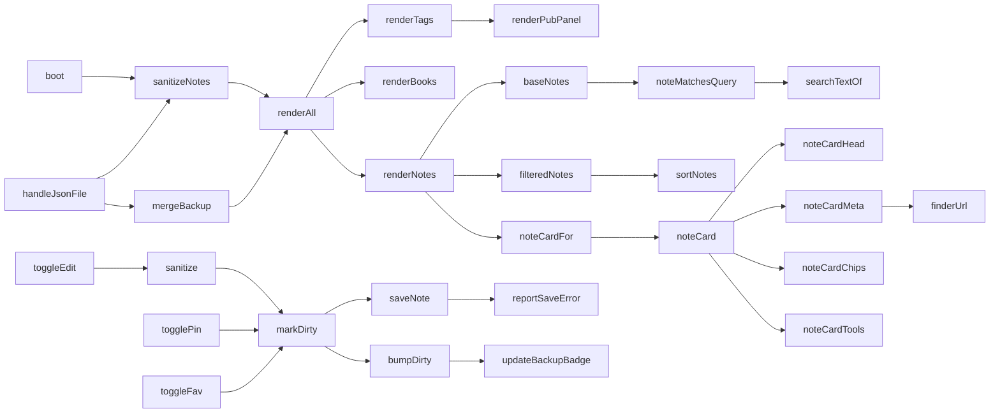

# Najważniejsze funkcje

Pełne opisy są w kodzie jako komentarze `/** */` nad definicjami. Tutaj skrót
z podziałem na zadania oraz zależności między funkcjami.

## Start i dane

| Funkcja | Moduł | Opis |
|---|---|---|
| `boot()` | 03-boot | uruchomienie aplikacji: baza → dane → ustawienia → pierwsze renderowanie |
| `decodeEmbedded()` | 03-boot | rozpakowanie paczki wbudowanej w HTML (base64 + gzip) |
| `idbOpen()` | 02-storage | otwarcie IndexedDB i założenie magazynów |
| `idbBulkChunked(store, items)` | 02-storage | zapis dużej listy w porcjach |
| `saveNote(n)` | 02-storage | zapis jednej notatki |
| `sanitizeNote(n)` | 02-storage | sito na pojedynczą notatkę; `null` = rekord nie do użycia |
| `sanitizeNotes(list, źródło)` | 02-storage | sito na listę + informacja, ile odpadło |
| `sanitizeTags(list, źródło)` | 02-storage | sito na etykiety, odsiewa powtórzone identyfikatory |
| `reportSaveError(e, co)` | 02-storage | jedyne miejsce, w którym kończą błędy zapisu |

## Ustawienia

| Funkcja | Moduł | Opis |
|---|---|---|
| `lsSet(key, val)` | 01-core | zapis pomijany, gdy wartość bez zmian; zwraca czy zapisano |
| `lsGet(key, def)` | 01-core | odczyt zawsze z prawdziwej pamięci |
| `lsSetSoon(key, val, ms)` | 01-core | zapis odroczony, skleja serie zmian |
| `lsFlush()` | 01-core | dopisanie kolejki przy chowaniu karty |

## Renderowanie

| Funkcja | Moduł | Opis |
|---|---|---|
| `renderAll()` | 09-notes | pełne odświeżenie: etykiety, księgi, notatki, czytnik |
| `renderNotes()` | 09-notes | lista notatek z pamięcią podręczną kart |
| `noteCardSig(n)` | 09-notes | „odcisk" karty — podstawa decyzji o przebudowie |
| `noteCardFor(n)` | 09-notes | karta z pamięci albo nowa |
| `syncChildren(parent, wanted)` | 09-notes | ustawienie kolejności węzłów minimalną liczbą ruchów |
| `noteCard(n)` | 09-notes | budowa karty wraz z obsługą zdarzeń |
| `renderTags()` | 06-tags | kolumna Etykiety, sekcje, liczniki |
| `renderBooks()` | 08-books | kolumna Księgi z rozdziałami |
| `renderPubPanel()` | 05-publications | panel Publikacje, trzy poziomy nawigacji |
| `setText(el, txt)`, `setHtml(el, html)` | 01-core | zapis tylko przy faktycznej zmianie |

## Filtrowanie i wyszukiwanie

| Funkcja | Moduł | Opis |
|---|---|---|
| `baseNotes()` | 06-tags | notatki po filtrach kolumn i wyszukiwarki |
| `filteredNotes(base)` | 06-tags | baza + szybki filtr |
| `matchesQuick(n)` | 06-tags | szybki filtr: przypięte, ulubione, bez etykiety, ze zdjęciem, tydzień |
| `sortNotes(arr)` | 09-notes | sortowanie wg `sortMode`; przypięte zawsze na górze |
| `parseQuery(q)` | 05-publications | rozkład zapytania na wyrażenia regularne |
| `noteMatchesQuery(n)` | 05-publications | dopasowanie notatki do zapytania |
| `searchTextOf(n)` | 05-publications | gotowe teksty do szukania, liczone raz na notatkę |
| `norm(s)` | 09-notes | małe litery i usunięcie ogonków |

## Działania na notatce

| Funkcja | Moduł | Opis |
|---|---|---|
| `markDirty(n)` | 12-actions | data zmiany + zapis + licznik zmian — **wejście dla każdej edycji** |
| `toggleEdit(card, n)` | 14-images | włączenie i zakończenie edycji w miejscu |
| `sanitize(html)` | 14-images | czyszczenie HTML z edytora |
| `togglePin(n)` / `toggleFav(n)` | 09-notes | przypięcie / ulubione |
| `delNote(n)` | 12-actions | przeniesienie do kosza (30 dni) |
| `pushUndo(u)` | 12-actions | odłożenie operacji na stos cofania |
| `deepCopy(obj)` | 12-actions | kopia głęboka z zapasowym wariantem |
| `openFs(n)` | 10-reader | otwarcie czytnika |
| `saveNoteOrder()` | 24-reorder | zapis własnej kolejności po przeciągnięciu |

## Wymiana danych

| Funkcja | Moduł | Opis |
|---|---|---|
| `handleJsonFile(e)` | 20-backup | wczytanie kopii JSON: sprawdzenie, sito, wybór trybu |
| `mergeBackup(data, takeLayout)` | 20-backup | scalenie kopii; dopasowanie po nazwach, nie po identyfikatorach |
| `applyChangesToDb(db)` | 18-export-jwl | naniesienie notatek i etykiet na bazę SQLite |
| `noteExportHtml(n)` / `notesExportHtml(list, tytuł)` | 19-export-doc | dokument do Word i PDF |
| `finderUrl(n)` | 09-notes | odnośnik otwierający miejsce w JW Library |

## Interfejs

| Funkcja | Moduł | Opis |
|---|---|---|
| `toast(msg, typ)` | 21-ui-helpers | komunikat; `ok` = ptaszek, `err` = ostrzeżenie i dłuższy czas |
| `flashOk(el)` | 21-ui-helpers | mrugnięcie po udanym zapisie |
| `placeDropdown(dd, anchor)` | 04-filters | menu zawsze mieści się na ekranie |
| `openContextMenu(target, x, y)` | 25-context-menu | prawy przycisk i długie przytrzymanie |
| `openSettings()` | 26-settings | panel ustawień |
| `askText / askConfirm / showInfo / askChoice` | 13-editor | okna dialogowe zastępujące `prompt` i `confirm`, zablokowane w trybie PWA na iOS |

## Zależności — kto kogo woła

Zasada, którą warto zapamiętać: **każda zmiana treści przechodzi przez `markDirty()`,
a każde odświeżenie ekranu przez `renderAll()`.** Dwa wąskie gardła, przez które
przechodzi wszystko — dobre miejsca na pułapkę przy szukaniu błędu.
