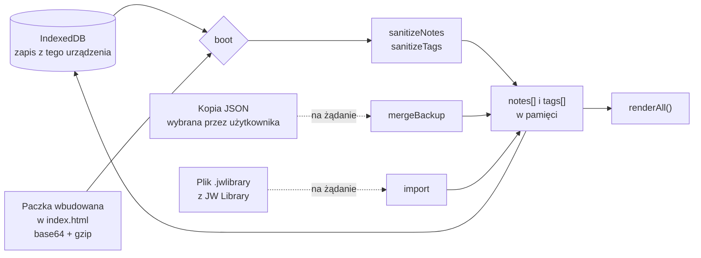
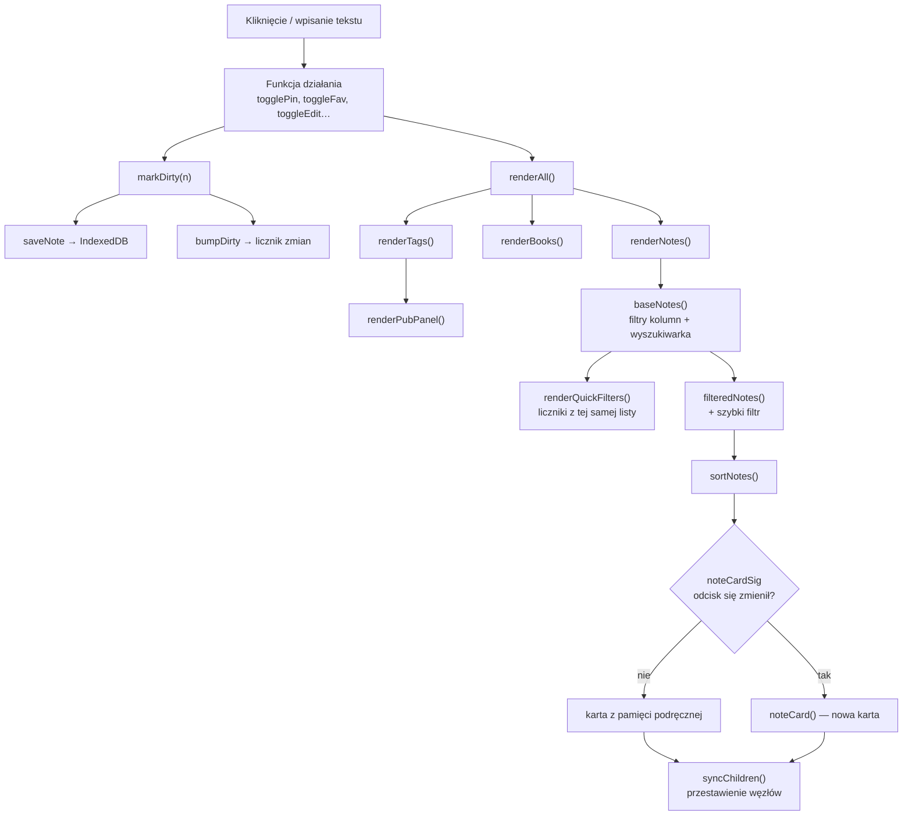
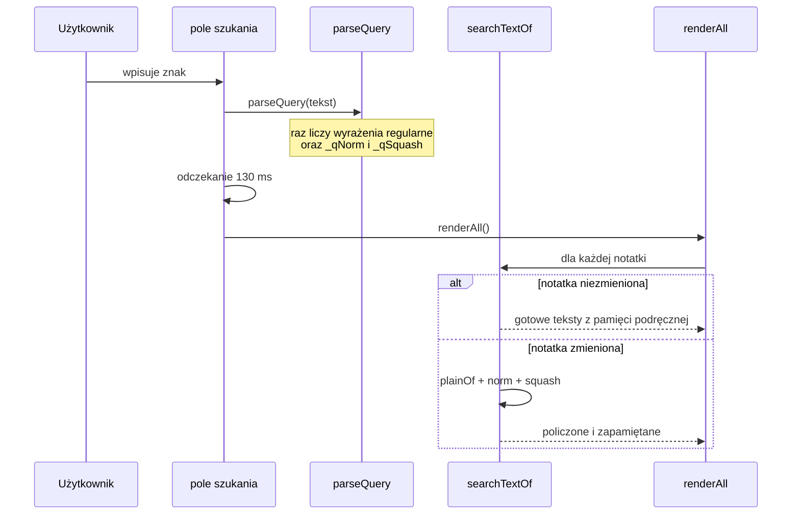
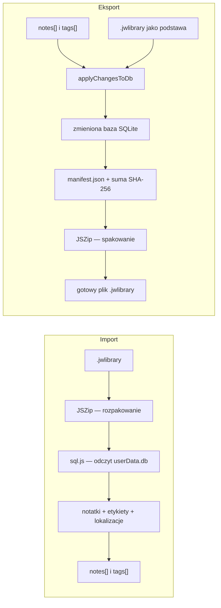
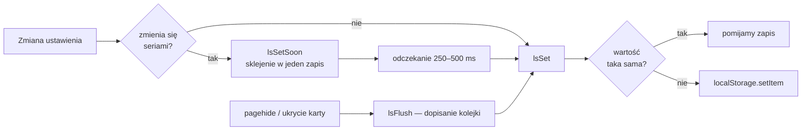

# Przepływ danych

## Skąd biorą się notatki

Przy każdym uruchomieniu dane pochodzą z trzech źródeł, które `boot()` scala w jedną listę.

Pierwszeństwo ma zawsze zapis z urządzenia. Paczka wbudowana służy do uzupełnienia
braków — jeśli notatka jest w paczce, a nie ma jej w pamięci przeglądarki, zostaje dodana.
Nic nie jest nadpisywane bez pytania.

## Od kliknięcia do ekranu

Kluczowy jest romb na dole: karta powstaje od nowa tylko wtedy, gdy zmieniło się coś,
co na niej widać. Przy zmianie jednej notatki spośród tysiąca budowana jest jedna karta.

## Wyszukiwanie

Bez pamięci podręcznej każdy wciśnięty klawisz przeliczałby `plainOf()` dla wszystkich
notatek, a w środku `refLabel`, `pubFullName` i `issueLabel`.

## Wymiana z JW Library

Eksport zawsze potrzebuje pliku podstawowego z JW Library — aplikacja nie tworzy bazy
od zera, tylko nanosi zmiany na istniejącą. Dzięki temu plik zachowuje wszystko,
czego aplikacja nie obsługuje.

## Zapis ustawień

